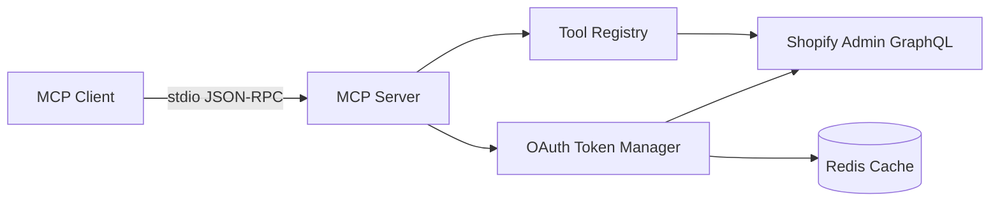
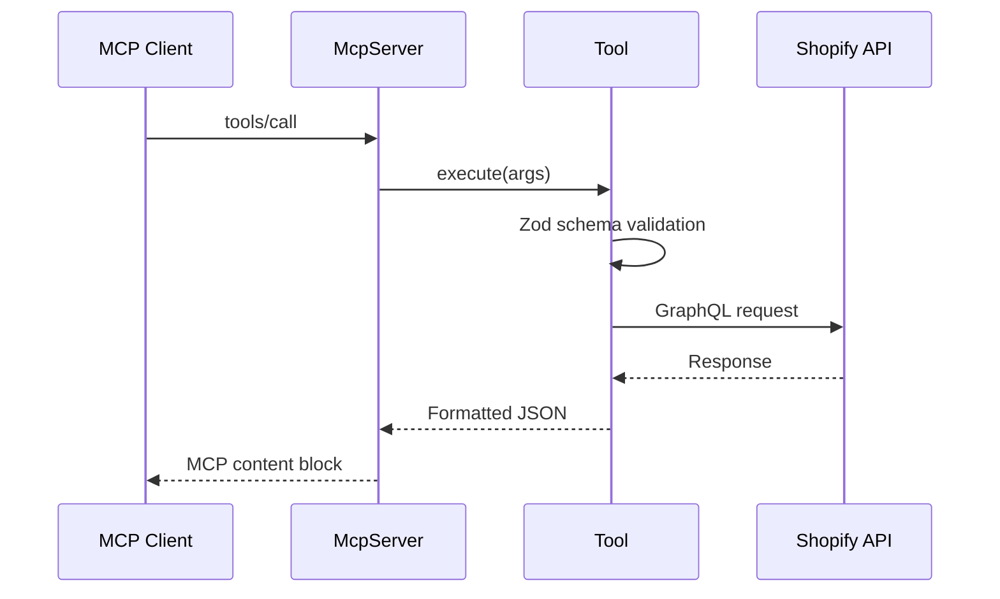
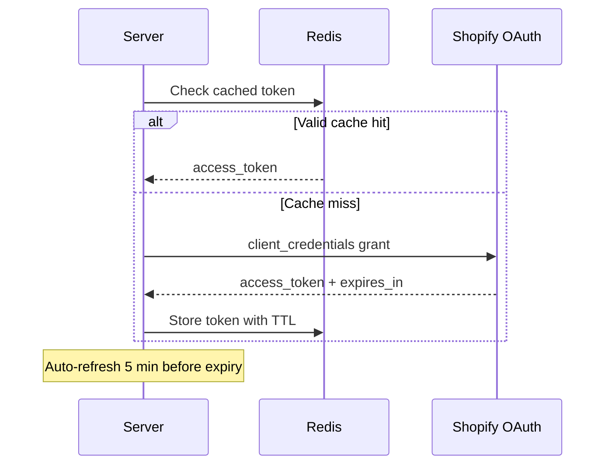

# Shopify MCP Server

A production-oriented [Model Context Protocol](https://modelcontextprotocol.io/) server that exposes the Shopify Admin GraphQL API to AI assistants. Connect Claude Desktop, Claude Code, or any MCP-compatible client to manage products, customers, orders, inventory, and metafields through a typed tool interface.

---

## Table of Contents

- [Overview](#overview)
- [Architecture](#architecture)
- [Features](#features)
- [Requirements](#requirements)
- [Installation](#installation)
- [Configuration](#configuration)
- [Development](#development)
- [Testing](#testing)
- [Project Structure](#project-structure)
- [Troubleshooting](#troubleshooting)
- [Contributing](#contributing)
- [FAQ](#faq)
- [License](#license)

---

## Overview

This server translates MCP tool calls into Shopify Admin GraphQL operations. It supports static access tokens and OAuth client-credentials (Dev Dashboard apps), optional Redis-backed token persistence, structured JSON logging, and graceful shutdown.



---

## Architecture

### Runtime layers

| Layer | Responsibility |
|-------|----------------|
| `src/index.ts` | Process entry, error boundary |
| `src/server/` | Bootstrap, MCP wiring, shutdown hooks |
| `src/config/` | Environment and CLI configuration |
| `src/lib/` | Auth, logging, Redis, shared utilities |
| `src/tools/` | 40 MCP tools (products, orders, customers, …) |

### Request workflow



### Authentication flow



---

## Features

| Category | Capabilities |
|----------|-------------|
| **Products** | CRUD, variants, options, collections |
| **Customers** | CRUD, merge, address management |
| **Orders** | Query, cancel, fulfill, refund, draft orders |
| **Metafields** | Read, write, delete on any resource |
| **Inventory** | Set quantities, read levels and items |
| **Discovery** | Shop info, locations, markets, price lists |
| **Platform** | Redis token cache, structured logging, graceful shutdown, strict TypeScript |

All list tools support cursor pagination, sorting, and Shopify search syntax filtering.

---

## Requirements

- **Node.js** 18 or later
- **Shopify store** with a custom app and Admin API scopes
- **Redis** (optional) for OAuth token persistence across restarts

### Required Admin API scopes

`read_products`, `write_products`, `read_customers`, `write_customers`, `read_orders`, `write_orders` (plus scopes for inventory/metafields as needed).

---

## Installation

### Run with npx (recommended)

```bash
npx shopify-mcp \
  --clientId YOUR_CLIENT_ID \
  --clientSecret YOUR_CLIENT_SECRET \
  --domain your-store.myshopify.com
```

### Install from source

```bash
git clone https://github.com/GeLi2001/shopify-mcp.git
cd shopify-mcp
npm install
npm run build
npm start
```

### Claude Desktop

Add to `claude_desktop_config.json`:

```json
{
  "mcpServers": {
    "shopify": {
      "command": "npx",
      "args": [
        "shopify-mcp",
        "--clientId", "<CLIENT_ID>",
        "--clientSecret", "<CLIENT_SECRET>",
        "--domain", "<store>.myshopify.com"
      ]
    }
  }
}
```

Config locations:
- **macOS:** `~/Library/Application Support/Claude/claude_desktop_config.json`
- **Windows:** `%APPDATA%/Claude/claude_desktop_config.json`

---

## Configuration

Copy `.env.example` to `.env` and fill in values:

```bash
cp .env.example .env
```

### Environment variables

| Variable | Required | Description |
|----------|----------|-------------|
| `MYSHOPIFY_DOMAIN` | Yes | Store domain, e.g. `store.myshopify.com` |
| `SHOPIFY_ACCESS_TOKEN` | Option A | Static `shpat_` token (legacy apps) |
| `SHOPIFY_CLIENT_ID` | Option B | Dev Dashboard client ID |
| `SHOPIFY_CLIENT_SECRET` | Option B | Dev Dashboard client secret |
| `SHOPIFY_API_VERSION` | No | API version (default: `2026-01`) |
| `LOG_LEVEL` | No | `debug`, `info`, `warn`, `error` |
| `REDIS_ENABLED` | No | Enable Redis persistence (`true`/`false`) |
| `REDIS_URL` | If Redis | Connection URL, e.g. `redis://127.0.0.1:6379` |
| `REDIS_KEY_PREFIX` | No | Key namespace prefix (default: `shopify-mcp:`) |
| `REDIS_MAX_RETRIES` | No | Max command retries (default: `10`) |
| `REDIS_CONNECT_TIMEOUT_MS` | No | Connect timeout in ms (default: `10000`) |

CLI flags (`--accessToken`, `--clientId`, `--clientSecret`, `--domain`, `--apiVersion`) override environment variables.

---

## Development

```bash
# Install dependencies
npm install

# Run in development (TypeScript directly)
npm run dev

# Full validation pipeline
npm run validate

# GraphQL schema validation
npm run validate:graphql
```

### Scripts

| Script | Purpose |
|--------|---------|
| `npm run build` | Compile TypeScript to `dist/` |
| `npm run typecheck` | Type-check source and tests |
| `npm run lint` | ESLint |
| `npm test` | Jest unit tests |
| `npm run validate` | typecheck + lint + test + build |

---

## Testing

Tests live in `tests/` and cover configuration parsing, logging, error utilities, and Redis token caching.

```bash
npm test
```

Tests use mocked Redis clients — no running Redis instance required for the test suite.

---

## Project Structure

```
shopify-mcp/
├── docs/
│   └── AUDIT.md           # Internal architecture audit
├── src/
│   ├── config/            # Environment loading (Zod-validated)
│   ├── lib/               # Auth, logging, Redis, tool factory
│   │   └── redis/         # Connection manager + token cache
│   ├── server/            # Bootstrap, MCP server, shutdown
│   ├── tools/             # MCP tool implementations
│   └── index.ts           # Entry point
├── tests/                 # Unit tests
├── .env.example           # Configuration template
├── .github/workflows/     # CI (build, lint, test, typecheck)
└── package.json
```

**Design decisions:**
- Tools use a `createTool()` factory to eliminate duplicated GraphQL client wiring.
- Configuration is centralized in `src/config/env.ts` with Zod validation.
- OAuth tokens optionally persist in Redis so restarts do not force re-authentication.
- Logs are structured JSON on stderr (safe for stdio MCP transport).

---

## Troubleshooting

### Authentication errors

```
Authentication credentials are required
```

Provide either `SHOPIFY_ACCESS_TOKEN` or both `SHOPIFY_CLIENT_ID` and `SHOPIFY_CLIENT_SECRET`.

### Wrong package installed

If you see errors referencing a different package name, verify you are running `shopify-mcp` (this package), not a similarly named alternative.

### MCP connection issues

Check Claude Desktop MCP logs:

```bash
# macOS
tail -f ~/Library/Logs/Claude/mcp*.log
```

Ensure the server starts without errors:

```bash
SHOPIFY_ACCESS_TOKEN=shpat_xxx MYSHOPIFY_DOMAIN=store.myshopify.com npm start
```

### Redis connection failures

If `REDIS_ENABLED=true` but Redis is unreachable, the server exits at startup. Either start Redis locally or set `REDIS_ENABLED=false`.

```bash
docker run -d -p 6379:6379 redis:7-alpine
```

### GraphQL userErrors

Shopify returns field-level errors in mutation responses. The server surfaces these as `Failed to <operation>: field: message`.

---

## Contributing

1. Fork the repository and create a feature branch.
2. Run `npm run validate` before opening a pull request.
3. Keep commits focused and write clear commit messages.
4. Add tests for new library or configuration behavior.
5. Do not commit secrets, `.env`, or `package-lock.json`.

---

## FAQ

**Does this replace the Shopify Admin UI?**  
No. It provides programmatic access for AI assistants via MCP.

**Can I use a static access token?**  
Yes. Set `SHOPIFY_ACCESS_TOKEN` for legacy custom apps with `shpat_` tokens.

**Is Redis required?**  
No. Redis is optional and only caches OAuth tokens for client-credentials auth.

**How many tools are available?**  
40 tools covering products, customers, orders, metafields, inventory, and store discovery.

**Which API version is used?**  
Default `2026-01`. Override with `SHOPIFY_API_VERSION` or `--apiVersion`.

**Why JSON logs on stderr?**  
MCP uses stdout for the protocol. Logs must go to stderr to avoid corrupting the transport.

---

## License

MIT — see [LICENSE](LICENSE).
